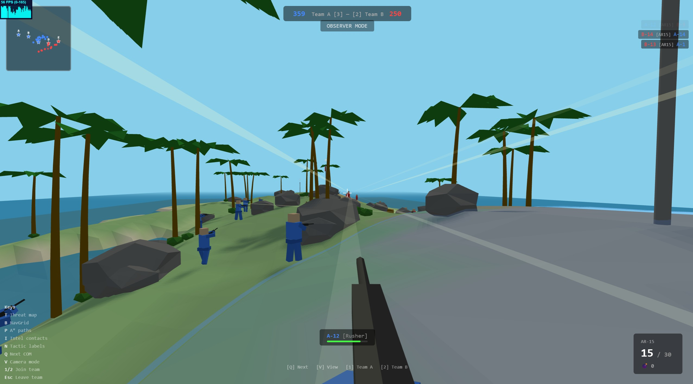
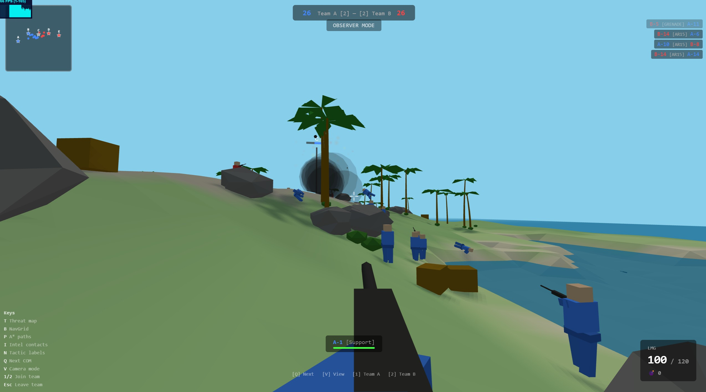

# Island Conquest

*[繁體中文版](README.zh-TW.md)*

A multiplayer 3D first-person shooter running in the browser. A Node.js server runs the authoritative game simulation — two AI teams of 15 soldiers each (5 squads of 3) battle over 5 flag points on a procedurally generated tropical island. Multiple players can connect via WebSocket, join either team, and fight alongside the AI. Spectators can watch the battle in real time.

Built with **Three.js** + **cannon-es** + **WebSocket** (`ws`). Server-authoritative with client-side prediction and snapshot interpolation.

**Live Demo: https://island-conquest.wwwang.tw/**




## Quick Start

```bash
npm install
npm run build
npm start
```

Open `http://localhost:8088` in your browser. Other players on the same network can connect using the host's LAN IP (e.g. `http://192.168.1.x:8088`).

## Tech Stack

- **Node.js** — Authoritative game server
- **ws** — WebSocket server for real-time binary protocol
- **Three.js r0.162** — 3D rendering (client)
- **cannon-es 0.20** — Physics engine (server)
- **three-mesh-bvh** — BVH-accelerated raycasting (server hitscan)
- **Vite** — Client bundling (production build into `dist/`)
- **Web Workers** — NavGrid construction, threat map & threat scan computation off main thread

## Flags & Scoring

5 capture points arranged in one of two layouts (random per match):
- **Linear**: Straight line along the island center
- **1-3-1**: 1 flag at each end, 3 spread across the middle

Capture rules:
- Stand within 8m radius to capture
- Solo capture takes ~10 seconds; each additional teammate adds 30% speed
- Contested (both teams present): no progress change
- Must neutralize enemy flag to 0 before capturing

Scoring:
- +1 point per owned flag every 3 seconds
- First team to **500 points** wins
- 3 flags = 60 pts/min; 5 flags = 100 pts/min

After a match ends, a 30-second countdown begins before the next round starts automatically.

---

## Controls

### Spectator Mode

| Key | Action |
|-----|--------|
| Q | Cycle to next soldier (both teams) |
| V | Toggle first-person follow / overhead bird's-eye view |
| W/A/S/D | Pan camera (overhead mode only) |
| Mouse Wheel | Zoom in/out (overhead mode only) |
| 1 | Join Team A |
| 2 | Join Team B |

### Weapon Selection (Join & Respawn Screens)

| Key | Weapon |
|-----|--------|
| 1 | AR15 — Assault Rifle |
| 2 | SMG — Submachine Gun |
| 3 | LMG — Light Machine Gun |
| 4 | BOLT — Bolt-Action Sniper Rifle |
| SPACE | Deploy / Respawn |
| ESC | Cancel and return to spectator |

### Playing Mode

| Key | Action |
|-----|--------|
| W/A/S/D | Move |
| SPACE | Jump |
| Mouse | Look around |
| Left Click (hold) | Fire weapon |
| Right Click | Toggle scope (BOLT only) |
| R | Reload |
| G | Throw grenade |
| E | Board / exit helicopter |
| ESC | Release cursor; press again to leave team |

### Helicopter Controls (Pilot)

| Key | Action |
|-----|--------|
| W/S | Pitch forward / backward |
| A/D | Turn left / right |
| SPACE | Ascend |
| SHIFT | Descend |
| Left Click | Fire (passengers can also fire from seats) |

### Debug Overlays (All Modes)

| Key | Action |
|-----|--------|
| TAB (hold) | Scoreboard with K/D stats and ping |
| T | Cycle threat map overlay (off / Team A / Team B) |
| B | Toggle NavGrid blocked cells |
| P | Toggle A* path debug arcs |
| I | Cycle intel contacts (off / Team A / Team B) |
| N | Toggle tactical labels on soldiers |

---

## Joining the Game

1. Open the game URL and enter the server address (auto-detected for same-host).
2. Press **Connect** — you enter spectator mode.
3. Press **1** (Team A) or **2** (Team B).
4. A weapon selection screen appears — pick your weapon with **1–4**.
5. Press **SPACE** to deploy. Your cursor will be locked for FPS control.
6. On death, you have 5 seconds before you can choose a new weapon and respawn with **SPACE**.
7. Press **ESC** twice (once to unlock cursor, again to confirm) to leave the team and return to spectator mode.

---

## Weapons

| Weapon | Damage | RPM | Magazine | Reload | Range | Move Speed | Special |
|--------|--------|-----|----------|--------|-------|------------|---------|
| **AR15** | 25 | 600 | 30 | 2.5s | 200m | 1.0x | Balanced all-rounder |
| **SMG** | 18 | 900 | 35 | 2.0s | 120m | 1.15x | High fire rate, fast movement |
| **LMG** | 20 | 450 | 120 | 5.0s | 180m | 0.7x | Sustained fire tightens spread |
| **BOLT** | 110 | 40 | 5 | 3.5s | 300m | 0.85x | 2.5x headshot, 1.2s bolt cycle, scope |

**Grenade**: 200 damage at center, 6m blast radius, 2.5s fuse, 2 per life.

### Damage Model

- **Headshot** (hit above shoulder): 2x damage (BOLT: 2.5x = 275, instant kill)
- **Bodyshot**: 1x damage
- **Legshot** (hit below knee): 0.5x damage
- **Health regen**: 10 HP/s after 5 seconds without taking damage

### LMG Unique Mechanic

The LMG's spread *decreases* with sustained fire — holding the trigger makes it more accurate over time. Releasing the trigger resets spread back to its (relatively wide) base value.

### Bolt-Action Scope

Right-click toggles a scope that narrows FOV from ~75 to 20. The gun model hides while scoped, replaced by a vignette overlay. Scoping is blocked during bolt cycling and reloading.

---

## Vehicles

### Helicopter

Each team has a helicopter that spawns at their base. Seats 1 pilot + 4 passengers.

- **HP**: 12,000
- **Max speed**: 45 m/s horizontal, 8 m/s vertical
- **Enter radius**: 3.6m — press **E** to board, **E** again to exit
- **Pilot** controls flight (WASD + SPACE/SHIFT); passengers can fire from their seats
- Destroyed helicopters crash with physics-based debris

---

## AI Systems

### Team Structure

Each team has **15 soldiers** organized into **5 squads of 3**:

| Squad | Composition | Strategy |
|-------|-------------|----------|
| **Alpha** | Captain, Support, Rusher | Push — rush distant enemy flags |
| **Bravo** | Captain, Flanker, Support | Secure — defend threatened flags |
| **Charlie** | Captain, Defender, Sniper | Secure — defend threatened flags |
| **Delta** | Captain, Rusher, Flanker | Push — rush distant enemy flags |
| **Echo** | Rusher, Flanker, Rusher | Raid — hunt undefended flags |

### Personalities

Each soldier has one of 6 personality types that govern their behavior:

| Personality | Aim Skill | Reaction | Risk Tolerance | Role |
|-------------|-----------|----------|----------------|------|
| **Rusher** | 0.7 | 150ms | High (0.75) | Aggressive point man |
| **Defender** | 0.8 | 200ms | Low (0.45) | Holds positions cautiously |
| **Flanker** | 0.75 | 180ms | Medium (0.65) | Flanks around enemies |
| **Support** | 0.7 | 200ms | Medium (0.55) | Suppression & area denial |
| **Sniper** | 0.9 | 250ms | Low (0.50) | Long-range precision |
| **Captain** | 0.8 | 180ms | Medium (0.60) | Squad leader, balanced |

### Weapon Selection

AI soldiers pick weapons based on personality:

- **Sniper**: 60% BOLT / 20% AR15 / 20% SMG
- **Support & Defender**: 60% LMG / 20% AR15 / 20% SMG
- **Others** (Rusher, Flanker, Captain): 42.5% AR15 / 42.5% SMG / 10% LMG / 5% BOLT

### Behavior Tree

Each AI runs a priority-ordered behavior tree (ticked every 0.15–0.25s, staggered across soldiers):

1. **Dead** — wait for respawn
2. **Reloading near threats** — seek cover
3. **High risk** — seek cover (threshold varies by personality)
4. **Spatial threat** — move away from threat map hotspots
5. **Fallback** — retreat to friendly flag (squad tactic)
6. **Rush** — coordinated assault (squad tactic)
7. **Suppression fire** — suppress lost contacts (squad tactic)
8. **Crossfire** — flank to perpendicular positions (squad tactic)
9. **Throw grenade** — if enemies clustered near flag
10. **Close-range enemy** (< 20m) — engage immediately
11. **Uncaptured flag** — move to capture
12. **Investigate intel** — move toward suspected enemy position
13. **Visible enemy** (long range) — engage
14. **Defend owned flag** — patrol nearby
15. **Default** — random patrol

Continuous systems (aiming, shooting, movement) run every frame for all 30 soldiers, while the behavior tree and threat scanning run in staggered batches of 8 per tick for performance.

### Line of Sight

Grid-based Bresenham ray march on a 300x120 height grid (1m cells). Each cell stores `max(terrain_height, obstacle_top)`.

**Dual-ray system**:
- **Ray 1**: Eye-to-eye (1.5m → 1.5m) — full body visibility
- **Ray 2**: Eye-to-head-top (1.5m → 1.7m) — partial cover (head-only)

If only the head is visible, the AI aims at head height instead of body center.

Scan parameters: 80m max range, 120° forward cone.

### Aiming

- **Aim correction speed**: `2 + aimSkill × 3` (range 4.1–4.7)
- **Reaction delay**: Base 150–250ms (per personality), dynamically scaled by four factors:
  - **Distance**: Linear interpolation between `nearReaction` and `farReaction` over 0–60m. Rusher reacts fast up close (×0.3) but slow at range (×1.4); Sniper is the opposite (×1.4 near, ×0.5 far)
  - **Aim angle**: Enemies near the crosshair center trigger faster reactions (×0.93); enemies at the FOV edge are slower (up to ×1.33)
  - **Line of sight**: Head-only targets (partial cover) add 40% delay (×1.4)
  - **Environment**: Storm/night multiplier (default ×1.0)
- **Pre-aiming**: Aim at predicted position of lost contacts (`lastPos + velocity × 0.5s`)
- **Head-only targets**: Aim point raised to 1.6m (head level) instead of 1.2m (chest)
- **BOLT AI delay**: Must hold aim for 0.5s before firing
- **Recoil**: Spread increases per shot, recovers when not firing
- **Combat strafe**: Random lateral movement every 0.4–0.8s during engagement

### Threat Map

A spatial heatmap computed in a **Web Worker** every 0.3s:

- 300x120 grid (1m cells), same as LOS grid
- For each enemy, Bresenham-marches outward up to 160m
- Cells with clear LOS to enemy accumulate threat: `1 / (1 + dist² × 0.001)`
- AI uses threat values for:
  - **Cover seeking**: Find lowest-threat walkable position within 20m
  - **Risk assessment**: Spatial threat is 25% of total risk score
  - **Pathfinding cost**: A* adds `threat × 1.5` penalty to movement cost
  - **Reflex dodge**: Pick lowest-threat direction when first targeted

### Team Intel

Shared sighting board per team with contact lifecycle:

```
VISIBLE (red) → 3s no LOS → LOST (orange) → 3s → SUSPECTED (gray) → 15s → CLEARED
```

Each contact tracks: last seen position, velocity, confidence (1.0 → 0.0 decay). Used for:
- Suppression target prediction
- Investigation waypoints
- Outnumbered assessment
- Grenade targeting

### Pathfinding (NavGrid)

Grid-based A* on a 600x240 grid (0.5m cells):

- **Blocked cells**: Deep water, steep slopes (> 75°), obstacle footprints
- **Proximity cost**: Cells near obstacles have higher traversal cost (avoids wall-hugging)
- **Threat penalty**: `threatGrid[cell] × 1.5` added to movement cost
- **Diagonal movement**: Allowed, with corner-cutting prevention
- **Heuristic**: Octile distance
- **Built in Web Worker** at startup to avoid blocking the main thread

### Squad Tactics

Squads coordinate through `SquadCoordinator`:

- **Formation**: Soldiers take role-based positions relative to objective (Rusher +8m forward, Sniper -15m behind, etc.)
- **Staggered reload**: Only one squad member reloads at a time
- **Coordinated rush**: 2+ alive, 50%+ ammo → 2s prep then assault (risk threshold raised to 0.95)
- **Fallback**: ≤ 1 alive and losing → retreat to friendly flag for 8s
- **Crossfire**: 2+ alive, 2+ threats near objective → spread to flanking positions
- **Suppression**: LMG holders get 1.5x duration; proactive suppression on lost contacts
- **Underdog bonus**: When 2+ flags behind, risk threshold +0.15 and rush requirements lowered

### Risk Assessment

Multi-factor risk score (0–1) determines cover-seeking behavior:

| Factor | Weight | Description |
|--------|--------|-------------|
| Exposure | 15% | In cover (0.3) vs exposed (0.7) |
| Incoming threat | 20% | Distance-weighted enemy count within 60m |
| Health | 15% | `1 - HP / maxHP` |
| Spatial threat | 25% | Threat map value at current position |
| Outnumbered | 10% | Enemies minus allies nearby |
| Reload vulnerability | 10% | Reloading = 1.0, low ammo = 0.5 |
| Mission pressure | 5% | Idle or moving toward objective |

When risk exceeds personality threshold → seek cover. A sudden risk spike (> 0.15 jump) forces immediate path recalculation and evasive movement.

---

## Game Mechanics

### Spawning

Respawn priority:
1. Friendly-owned flag (10–15m away, random angle)
2. Near a living teammate who hasn't been in combat for 5+ seconds
3. Base fallback (first or last flag area)

### Terrain

Procedurally generated tropical island (300m × 120m):
- Simplex noise with 4 octaves of FBM
- Central ridge with elliptical island mask
- Height-based vertex coloring (sand → grass → rock)
- Vegetation: palm trees with shadows
- Cover objects: rocks, sandbags, crates, walls, fortifications

---

## Architecture

The game uses a **client-server architecture**. The server runs the authoritative simulation (physics, AI, hit detection, flag capture) at 64 ticks/second and streams binary snapshots to all connected clients over WebSocket. Clients render the world, interpolate remote entities, and predict local player movement.

```
server.js                 Server entry — creates ServerGame + NetworkManager
src/
  client-main.js          Client entry — creates ClientGame instance
  client/
    ClientGame.js          Client orchestrator: renderer, scene, camera, HUD, input
    NetworkClient.js       WebSocket connection + binary message handling
    EntityRenderer.js      Interpolated rendering of remote entities
    Interpolation.js       Snapshot interpolation logic
    FPSController.js       First-person camera + client-side movement prediction
    VehicleController.js   Vehicle camera + occupant positioning
    VehicleRenderer.js     Helicopter 3D model + animation
    SpectatorController.js Spectator camera modes (follow / bird's-eye)
    ClientHUD.js           DOM overlay: crosshair, ammo, HP, flags
    JoinScreen.js          Connection form + team/weapon selection UI
    DeathScreen.js         Death / respawn screen
    GameOverScreen.js      End-of-round screen
    Scoreboard.js          TAB scoreboard overlay
    WeaponCardUI.js        Weapon selection cards
  server/
    ServerGame.js          Authoritative game loop + simulation
    NetworkManager.js      HTTP static server + WebSocket broadcast
    ServerAIManager.js     Server-side AI manager (creates & updates all AI)
    ServerSoldier.js       Server-side soldier entity (physics + HP)
    ServerPlayer.js        Server-side player entity (input processing)
    ServerPhysics.js       cannon-es physics world wrapper
    ServerIsland.js        Server-side terrain + collidable generation
    ServerHelicopter.js    Server-side helicopter simulation
    ServerVehicleManager.js Vehicle lifecycle management
    ServerGrenadeManager.js Grenade spawning + explosion logic
    RateLimiter.js         Per-client rate limiting
  shared/
    constants.js           Tick rate, port, map size, gameplay constants
    protocol.js            Binary message types + encode/decode helpers
    DamageModel.js         Shared damage calculation
    DamageFalloff.js       Range-based damage falloff curves
    CapsuleBody.js         Capsule physics body helper
  core/
    EventBus.js            Pub/sub messaging
    InputManager.js        Keyboard/mouse input + pointer lock
  entities/
    WeaponDefs.js          Weapon stat definitions
    Grenade.js             Grenade entity
    Vehicle.js             Vehicle base class
    Helicopter.js          Helicopter flight model + seats
  world/
    Island.js              Procedural terrain + vegetation
    CoverSystem.js         Cover point registry
    FlagPoint.js           Flag capture mechanics
    Fortification.js       Defensive structure generation
    Noise.js               Simplex noise
  ai/
    AIController.js        Per-soldier behavior tree + combat
    AIMovement.js          AI movement & pathfollowing
    AIShooter.js           AI aiming & firing logic
    AIGrenade.js           AI grenade usage logic
    AIVisual.js            AI line-of-sight scanning
    AIVehicleController.js AI helicopter piloting
    BehaviorTree.js        BT engine (Selector/Sequence/Condition/Action)
    Personality.js         6 personality types + squad templates
    SquadCoordinator.js    Squad-level tactics
    TeamIntel.js           Shared enemy sighting board
    ThreatMap.js           Spatial threat heatmap
    NavGrid.js             A* pathfinding
    TacticalActions.js     Flanking, suppression, pre-aim helpers
  systems/
    SpawnSystem.js         Respawn point selection
  vfx/
    TracerSystem.js        Bullet tracer lines
    ImpactVFX.js           Hit particles
    StormVFX.js            Weather effects
  ui/
    Minimap.js             Canvas-based minimap
    KillFeed.js            Kill notifications
    SpectatorHUD.js        Spectator UI overlay
  workers/
    navgrid-worker.js      Off-thread NavGrid construction (browser)
    navgrid-worker-node.js Off-thread NavGrid construction (Node.js)
    pathfind-worker.js     Off-thread A* pathfinding (browser)
    pathfind-worker-node.js Off-thread A* pathfinding (Node.js)
    threat-worker.js       Off-thread threat map computation (browser)
    threat-worker-node.js  Off-thread threat map computation (Node.js)
    threat-scan-worker.js  Off-thread threat scanning (browser)
    threat-scan-worker-node.js Off-thread threat scanning (Node.js)
```
