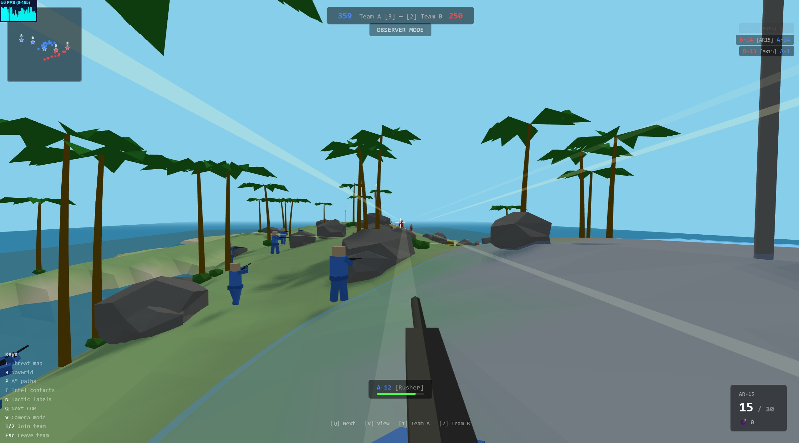
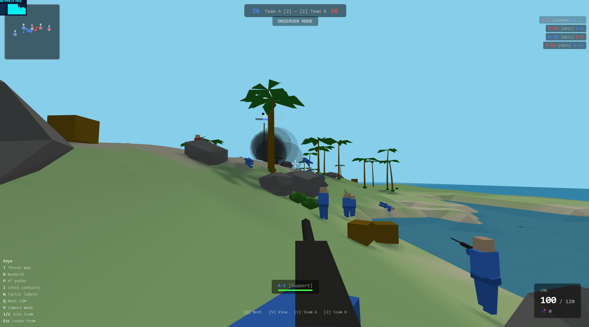

# Island Conquest

*[English Version](README.md)*

一款完全在瀏覽器中運行的單人 3D 第一人稱射擊遊戲。兩支 AI 隊伍 — 各 15 名士兵，編成 5 個 3 人小隊 — 在程序化生成的熱帶島嶼上爭奪 5 個旗點。你可以旁觀戰鬥，也可以加入任一隊伍親自參戰。

使用 **Three.js** + **cannon-es** 構建，無需任何打包工具。




## 快速開始

```bash
npx http-server -p 8080 -c-1 --cors
```

在瀏覽器中開啟 `http://localhost:8080`。

## 技術棧

- **Three.js r0.162** — 3D 渲染
- **cannon-es 0.20** — 物理引擎
- **原生 ES 模組** — 無打包工具，使用 index.html 中的 importmap
- **Web Workers** — NavGrid 建構 + 威脅地圖計算在背景執行緒進行

## 旗點 & 計分

5 個佔領點，隨機採用以下佈局之一：
- **直線型**：5 面旗沿島嶼中線排列
- **1-3-1 型**：兩端各 1 面，中段散佈 3 面

佔領規則：
- 站在 8m 半徑內即可佔領
- 單人佔領需約 10 秒；每多一名隊友加速 30%
- 雙方同時在場：進度不變（爭議狀態）
- 必須先將敵方旗點中和至 0 才能開始佔領

計分：
- 每 3 秒，每面己方旗幟 +1 分
- 先達到 **500 分** 的隊伍獲勝
- 3 面旗 = 60 分/分鐘；5 面旗 = 100 分/分鐘

---

## 操作說明

### 觀戰模式

| 按鍵 | 功能 |
|------|------|
| Q | 切換觀察下一名士兵（兩隊交替） |
| V | 切換第一人稱跟隨 / 鳥瞰俯視視角 |
| W/A/S/D | 平移鏡頭（僅鳥瞰模式） |
| 滑鼠滾輪 | 縮放（僅鳥瞰模式） |
| 1 | 加入 A 隊 |
| 2 | 加入 B 隊 |

### 武器選擇（加入 & 重生畫面）

| 按鍵 | 武器 |
|------|------|
| 1 | AR15 — 突擊步槍 |
| 2 | SMG — 衝鋒槍 |
| 3 | LMG — 輕機槍 |
| 4 | BOLT — 栓動狙擊步槍 |
| SPACE | 部署 / 重生 |
| ESC | 取消，返回觀戰模式 |

### 遊戲模式

| 按鍵 | 功能 |
|------|------|
| W/A/S/D | 移動 |
| SPACE | 跳躍 |
| 滑鼠移動 | 環顧 |
| 左鍵（按住） | 射擊 |
| 右鍵 | 切換瞄準鏡（僅 BOLT） |
| R | 換彈 |
| G | 投擲手榴彈 |
| ESC | 解除游標鎖定；再按一次離隊 |

### 除錯顯示（所有模式可用）

| 按鍵 | 功能 |
|------|------|
| TAB（按住） | 計分板（含擊殺/死亡統計） |
| T | 切換威脅地圖疊加層（關 / A 隊 / B 隊） |
| B | 切換導航網格阻擋格顯示 |
| P | 切換 A* 路徑除錯弧線 |
| I | 切換情報聯絡點顯示（關 / A 隊 / B 隊） |
| N | 切換士兵戰術標籤 |

---

## 如何加入遊戲

1. 在觀戰模式中，按 **1**（A 隊）或 **2**（B 隊）。
2. 出現武器選擇畫面 — 用 **1–4** 選擇武器。
3. 按 **SPACE** 部署。游標會被鎖定進入 FPS 操控。
4. 死亡後有 5 秒等待時間，之後可選擇新武器並按 **SPACE** 重生。
5. 按 **ESC** 兩次（第一次解除游標鎖定，第二次確認）離隊回到觀戰模式。

---

## 武器

| 武器 | 傷害 | 射速 | 彈匣 | 換彈 | 射程 | 移速 | 特點 |
|------|------|------|------|------|------|------|------|
| **AR15** | 25 | 600 RPM | 30 | 2.5s | 200m | 1.0x | 均衡型 |
| **SMG** | 18 | 900 RPM | 35 | 2.0s | 120m | 1.15x | 高射速、高機動 |
| **LMG** | 20 | 450 RPM | 120 | 5.0s | 180m | 0.7x | 持續射擊越打越準 |
| **BOLT** | 110 | 40 RPM | 5 | 3.5s | 300m | 0.85x | 2.5 倍爆頭、1.2s 拉栓、瞄準鏡 |

**手榴彈**：中心 200 傷害、6m 爆炸半徑、2.5 秒引信、每命 2 顆。

### 傷害模型

- **爆頭**（命中肩部以上）：2 倍傷害（BOLT：2.5 倍 = 275，一擊必殺）
- **身體**：1 倍傷害
- **腿部**（命中膝蓋以下）：0.5 倍傷害
- **生命回復**：受傷 5 秒後以 10 HP/s 速度回復

### LMG 獨特機制

LMG 的彈道散布會隨持續射擊而 *縮小* — 按住扳機越久越精準。鬆開扳機後散布回復到（相對寬的）基礎值。

### 栓動狙擊鏡

右鍵切換瞄準鏡，FOV 從 ~75 縮小到 20。開鏡時隱藏槍模型，改為暈影疊加層。拉栓和換彈期間無法開鏡。

---

## AI 系統

### 隊伍編制

每支隊伍 **15 名士兵**，編成 **5 個 3 人小隊**：

| 小隊 | 編成 | 戰略 |
|------|------|------|
| **Alpha** | 隊長、支援、突擊兵 | 推進 — 衝擊遠方敵旗 |
| **Bravo** | 隊長、側翼兵、支援 | 防守 — 防禦受威脅旗點 |
| **Charlie** | 隊長、防禦兵、狙擊手 | 防守 — 防禦受威脅旗點 |
| **Delta** | 隊長、突擊兵、側翼兵 | 推進 — 衝擊遠方敵旗 |
| **Echo** | 突擊兵、側翼兵、突擊兵 | 突襲 — 偷取無人防守旗點 |

### 個性系統

每名士兵具有 6 種個性之一，決定其行為模式：

| 個性 | 瞄準技巧 | 反應速度 | 風險容忍 | 角色定位 |
|------|---------|---------|---------|---------|
| **突擊兵 (Rusher)** | 0.7 | 150ms | 高 (0.75) | 激進尖兵 |
| **防禦兵 (Defender)** | 0.8 | 200ms | 低 (0.45) | 謹慎據守 |
| **側翼兵 (Flanker)** | 0.75 | 180ms | 中 (0.65) | 繞側突擊 |
| **支援兵 (Support)** | 0.7 | 200ms | 中 (0.55) | 壓制與封區 |
| **狙擊手 (Sniper)** | 0.9 | 250ms | 低 (0.50) | 遠程精準 |
| **隊長 (Captain)** | 0.8 | 180ms | 中 (0.60) | 小隊指揮、均衡 |

### 武器分配

AI 根據個性選擇武器：

- **狙擊手**：60% BOLT / 20% AR15 / 20% SMG
- **支援兵 & 防禦兵**：60% LMG / 20% AR15 / 20% SMG
- **其他**（突擊兵、側翼兵、隊長）：42.5% AR15 / 42.5% SMG / 10% LMG / 5% BOLT

### 行為樹

每個 AI 運行優先順序行為樹（每 0.15–0.25 秒執行一次，各士兵交錯執行）：

1. **死亡** — 等待重生
2. **換彈中且附近有威脅** — 尋找掩體
3. **高風險** — 尋找掩體（閾值因個性而異）
4. **空間威脅** — 遠離威脅地圖熱區
5. **撤退** — 退回友方旗點（小隊戰術）
6. **衝鋒** — 協同突擊（小隊戰術）
7. **壓制射擊** — 壓制失去視線的敵人（小隊戰術）
8. **交叉火力** — 展開至側翼位置（小隊戰術）
9. **投擲手榴彈** — 敵人在旗點附近聚集時
10. **近距離敵人**（< 20m）— 立即交戰
11. **未佔領旗點** — 前往佔領
12. **追查情報** — 前往可疑敵方位置
13. **遠距離可見敵人** — 交戰
14. **防守己方旗點** — 在附近巡邏
15. **預設** — 隨機巡邏

連續性系統（瞄準、射擊、移動）每幀為全部 30 名士兵執行；行為樹和威脅掃描則每幀分批 8 人執行以維持效能。

### 視線系統

基於網格的 Bresenham 射線行進，使用 300×120 高度網格（1m 格子）。每格儲存 `max(地形高度, 障礙物頂部)`。

**雙射線系統**：
- **射線 1**：眼對眼（1.5m → 1.5m）— 全身可見
- **射線 2**：眼對頭頂（1.5m → 1.7m）— 部分掩體（僅露頭）

若只有頭部可見，AI 會改為瞄準頭部高度而非身體中心。

掃描參數：最遠 80m、前方 120° 錐形視野。

### 瞄準機制

- **瞄準修正速度**：`2 + 瞄準技巧 × 3`（範圍 4.1–4.7）
- **反應延遲**：發現新目標後 150–250ms 才開火（依個性）
- **預瞄**：對失去視線的敵人，瞄準預測位置（`上次位置 + 速度 × 0.5 秒`）
- **僅露頭目標**：瞄準點提高至 1.6m（頭部）而非 1.2m（胸部）
- **BOLT AI 延遲**：瞄準 0.5 秒後才能開火
- **後座力**：每發射擊增加散布，停止射擊時回復
- **戰鬥閃避**：交戰期間每 0.4–0.8 秒隨機橫向移動

### 威脅地圖

在 **Web Worker** 中每 0.3 秒計算的空間熱力圖：

- 300×120 網格（1m 格子），與視線網格相同
- 對每個敵人，以 Bresenham 射線掃描 160m 範圍
- 有清晰視線的格子累計威脅值：`1 / (1 + 距離² × 0.001)`
- AI 使用威脅值進行：
  - **尋找掩體**：在 20m 範圍內找到威脅最低的可通行位置
  - **風險評估**：空間威脅佔總風險分數的 25%
  - **路徑規劃代價**：A* 演算法加上 `威脅值 × 1.5` 的懲罰
  - **反射閃避**：首次被瞄準時選擇威脅最低的方向

### 隊伍情報

每隊共享的敵方瞄準板，聯絡點生命週期：

```
可見(紅) → 3 秒無視線 → 失聯(橘) → 3 秒 → 可疑(灰) → 15 秒 → 清除
```

每個聯絡點追蹤：上次出現位置、速度、信心值（1.0 → 0.0 衰減）。用途：
- 壓制目標預測
- 調查路徑點
- 判斷人數劣勢
- 手榴彈目標選擇

### 路徑規劃（NavGrid）

基於 600×240 網格（0.5m 格子）的 A* 尋路：

- **阻擋格**：深水區、陡坡（> 75°）、障礙物佔地
- **鄰近代價**：靠近障礙物的格子有更高通行代價（避免貼牆走）
- **威脅懲罰**：`威脅網格[格子] × 1.5` 加到移動代價
- **對角線移動**：允許，有防穿牆角偵測
- **啟發函數**：八向距離（Octile distance）
- **在 Web Worker 中建構**：啟動時在背景執行緒建構，避免阻塞主執行緒

### 小隊戰術

小隊透過 `SquadCoordinator` 進行協調：

- **陣型**：士兵根據角色在目標旗點周圍佔據對應位置（突擊兵前方 +8m、狙擊手後方 -15m 等）
- **交錯換彈**：同一時間只有一名隊員換彈
- **協同衝鋒**：2 人以上存活且彈藥 50%+ → 2 秒準備後發起突擊（風險閾值提升至 0.95）
- **撤退**：≤ 1 人存活且正在失守 → 撤退至友方旗點 8 秒
- **交叉火力**：2 人以上存活、目標附近 2+ 威脅 → 展開至側翼位置
- **壓制**：LMG 持有者獲得 1.5 倍壓制時間；主動壓制失聯目標
- **劣勢加成**：落後 2 面旗以上時，風險閾值 +0.15 且降低衝鋒門檻

### 風險評估

多因子風險分數（0–1）決定掩體尋找行為：

| 因子 | 權重 | 說明 |
|------|------|------|
| 暴露程度 | 15% | 有掩體 (0.3) vs 暴露 (0.7) |
| 來襲威脅 | 20% | 60m 內距離加權的敵人數量 |
| 血量 | 15% | `1 - HP / maxHP` |
| 空間威脅 | 25% | 當前位置的威脅地圖數值 |
| 人數劣勢 | 10% | 附近敵人數 - 友軍數 |
| 換彈脆弱 | 10% | 換彈中 = 1.0，低彈藥 = 0.5 |
| 任務壓力 | 5% | 閒置或正在移動至目標 |

風險超過個性閾值 → 尋找掩體。風險突增（> 0.15 跳升）時強制立即重新規劃路徑並進行迴避移動。

---

## 遊戲機制

### 重生

重生優先順序：
1. 友方旗點（距離 10–15m，隨機角度）
2. 靠近存活且 5 秒以上未受傷的隊友
3. 基地回退（第一或最後一個旗點區域）

### 地形

程序化生成的熱帶島嶼（300m × 120m）：
- 使用 4 個八度的 FBM（分形布朗運動）噪音
- 中央山脊搭配橢圓形島嶼遮罩
- 基於高度的頂點著色（沙灘 → 草地 → 岩石）
- 植被：棕櫚樹（含地面投影陰影）
- 掩體物件：岩石、沙袋、木箱、牆壁

---

## 架構

```
src/
  main.js              入口
  core/
    Game.js            主協調器、遊戲循環、HUD
    EventBus.js        發布/訂閱訊息系統
    InputManager.js    鍵盤/滑鼠輸入
    SpectatorMode.js   觀戰攝影機控制
  entities/
    Soldier.js         基礎實體（模型、物理、HP）
    Player.js          FPS 玩家控制器
    Weapon.js          射線武器系統
    WeaponDefs.js      武器數值定義
  world/
    Island.js          程序化地形 + 植被
    CoverSystem.js     掩體點登錄
    FlagPoint.js       旗點佔領機制
    Noise.js           Simplex 噪音
  ai/
    AIManager.js       隊伍建立 & 交錯更新
    AIController.js    每士兵行為樹 + 戰鬥
    BehaviorTree.js    行為樹引擎（選擇/序列/條件/動作）
    Personality.js     6 種個性類型 + 小隊模板
    SquadCoordinator.js  小隊戰術
    TeamIntel.js       共享敵方瞄準板
    ThreatMap.js       空間威脅熱力圖
    NavGrid.js         A* 尋路
    TacticalActions.js 側翼、壓制、預瞄輔助函數
  systems/
    PhysicsWorld.js    cannon-es 封裝
    ScoreManager.js    旗點計分
    SpawnSystem.js     重生點選擇
  vfx/
    TracerSystem.js    彈道曳光線
    ImpactVFX.js       命中粒子效果
  ui/
    Minimap.js         Canvas 小地圖
    KillFeed.js        擊殺通知
    SpectatorHUD.js    觀戰 UI 疊加層
  workers/
    navgrid-worker.js  背景執行緒 NavGrid 建構
    threat-worker.js   背景執行緒威脅地圖計算
```

